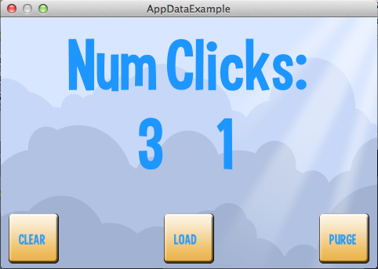

title: AppData Example
description: How to use AppData to store persistant application data for your app to the system.
source: src/AppDataExample.ls
thumbnail: images/screenshot.png
!------

## Overview
How to use AppData to store persistant application data for your app to the system.

## Try It
@cli_usage

## Screenshot

## Code
@insert_source
