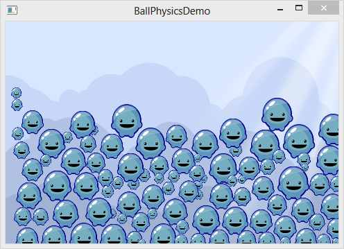

title: Ball Physics
description: An app demoing the use of the loom Physics class, featuring the creation and destruction of a series of various sized physics-enabled sprite objects.
source: src/BallPhysicsDemo.ls
!------

## Overview
An app demoing the use of the loom Physics class, featuring the creation and destruction of a series of various sized physics-enabled sprite objects.

Clicking on an empty space on the screen will create a randomly sized Poly.  Clicking on an existing Poly will remove it.

## Try It
@cli_usage

## Screenshot

## Code
@insert_source