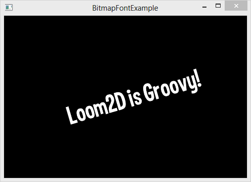

title: Bitmap Font Example
description: Demonstrates the ability to render bitmap fonts by placing a bitmap font rendered label on the stage, complete with animated scale and rotation.
source: src/BitmapFontExample.ls
!------

## Overview
Demonstrates the ability to render bitmap fonts by placing a bitmap font rendered label on the stage, complete with animated scale and rotation.

## Try It
@cli_usage

## Screenshot

## Code
@insert_source