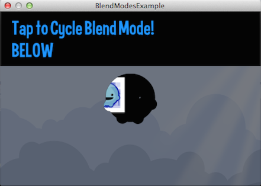

title: Blend Modes Example
description: How to set rendering blend modes on Display Objects
source: src/BlendModes.ls
thumbnail: images/screenshot.png
!------

## Overview
How to set rendering blend modes on Display Objects.

## Try It
@cli_usage

## Screenshot

## Code
@insert_source
