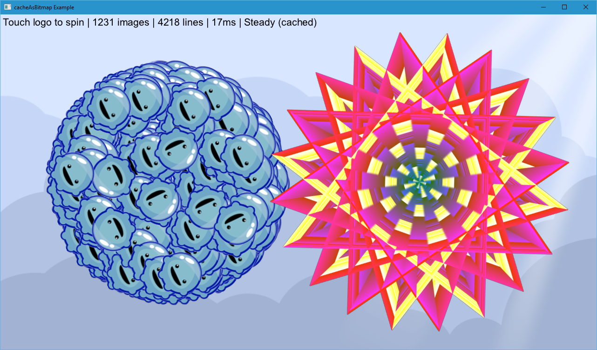

title: cacheAsBitmap Example
description: Benchmarks and shows example usage of the cacheAsBitmap API.
source: src/CacheAsBitmapExample.ls
thumbnail: images/screenshot.png
!------

## Overview
An example showing the use of cacheAsBitmap on many overdrawn images. When cacheAsBitmap is turned on, the untransformed contents get rendered into a texture, which is then used for further rendering. The behaviour of the contents remains the same (e.g. touch events will fire), however the displayed contents will remain static until you either turn caching off or update it manually using `invalidateBitmapCache`.

This can help with complex or overdrawn contents on slow GPUs.

## Try It
@cli_usage

## Screenshot

## Code
@insert_source
