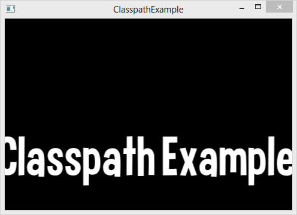

title: Classpath Example
description: How to use the loom.config classpath array to specify source folders to compile.
source: loom.config
thumbnail: images/screenshot.png
!------

## Overview
How to use the loom.config classpath array to specify source folders to compile.

## Try It
@cli_usage

## Screenshot

