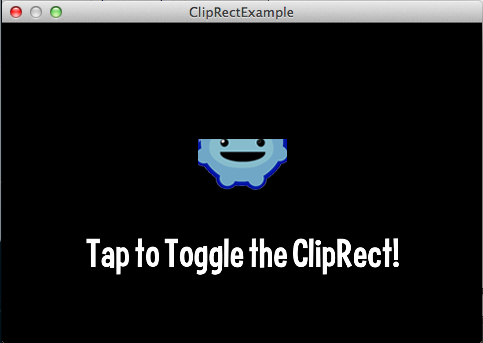

title: ClipRectangleExample
description: How to use the ClipRects to control the rendered area of screen
source: src/ClipRectExample.ls
!------

## Overview
How to use the clip rectangles to control the rendered area of screen

## Try It
@cli_usage

## Screenshot

## Code
@insert_source