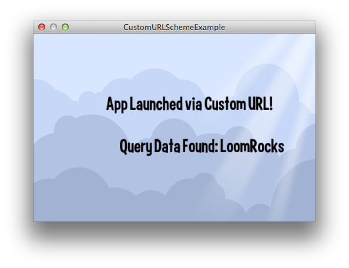

title: Custom URL Scheme Example
description: A simple example showing how you can launch your application on iOS or Android from a web browser with your own custom URL Scheme
source: src/CustomURLSchemeExample.ls
thumbnail: images/screenshot2.png
!------

## Overview
A simple example showing how you can launch your application on iOS or Android from a web browser with your own custom URL Scheme.

Inside of loom.config there is a property called 'custom_url_scheme'.  You can change this to whatever you wish, so long as you make it unique enough that no other mobile application could be using it, or it could conflict with someone else's URL scheme.

This also allows you to pass in Query data along with the URL in a format such as: 'playmygame://?key=data&key2=data2'

To run this example, you must first deploy it to a mobile device.  Once there, you must send your Custom URL Scheme to a web browser on the device which will then launch the example automatically.  If you also specify a single key of query data, such as 'playmygame://?key=LoomRocks', the app will pick that up and display it for you.

## Try It
@cli_usage

## Screenshots

## Code
@insert_source
