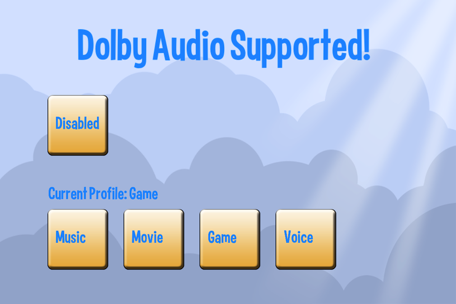

title: Dolby Audio Example
description: Basic usage of the Dolby Audio Library for Android Devices.
source: src/DolbyAudioExample.ls
thumbnail: images/screenshot.png
!------

## Overview
This example shows basic usage of the Dolby Audio Library.  Detecting if your Android device supports Dolby Audio and selecting which Audio Profile to use.

## Try It
@cli_usage

## Screenshots

## Code
@insert_source
