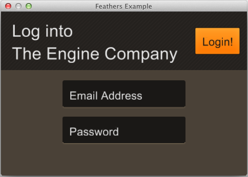
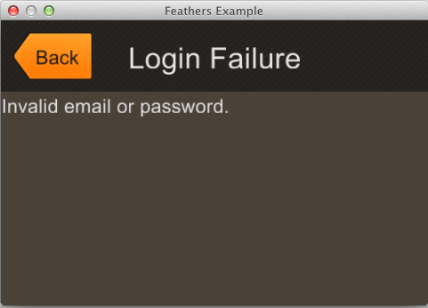

title: Feathers Example
description: Basic usage of the Feathers UI Library.  Creating screens, and navigating between them.
source: src/FeathersExample.ls
!------

## Overview
This example shows basic usage of the Feathers UI Library.  Creating screens, and navigating between them.

## Try It
@cli_usage

## Screenshots

## Code
@insert_source