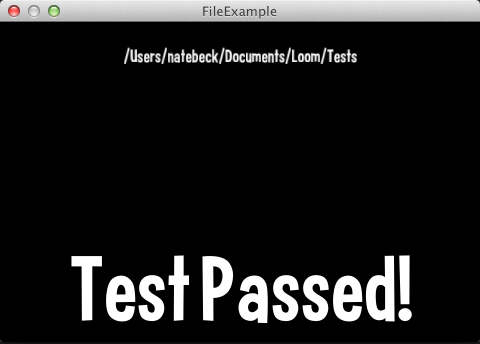

title: File Example
description: Simple example demonstrating File operations
source: src/FileExample.ls
thumbnail: images/screenshot.png
!------

## Overview
Loom has system.platform.File class which is a platform independant way to access the filesystem on the platform you are running on.

## Try It
@cli_usage

## Screenshot

## Code
@insert_source
