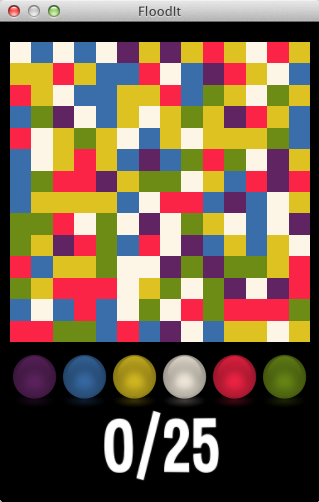
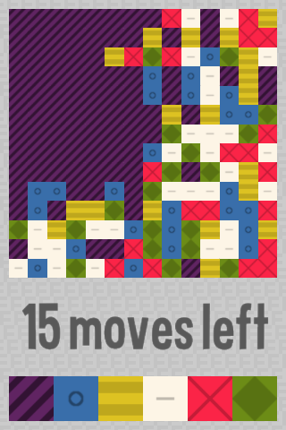

title: FloodIt
description: 
source: src/FloodIt.ls
!------

## Overview
Fun color matching game! Use the buttons in the bottom of the screen to change the colors of the region in the top left of the screen to make the whole board one color.

## Try It
@cli_usage

## Screenshots

## Code
@insert_source