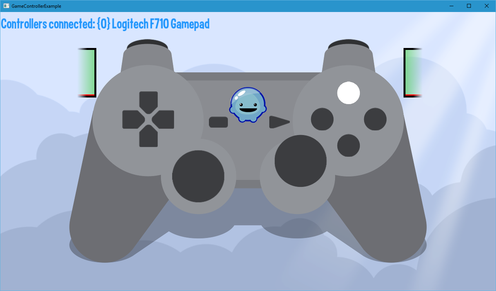

title: Game Controller Example
description: Shows how to use the GameController API and serves as a controller test case.
source: src/ControllerExample.ls
thumbnail: images/screenshot.png
!------

## Overview
Implements the GameController API and displays a representation of a gamepad and all of its buttons and their state.
Allows for controllers to be hotplugged, that is, controllers can be added and removed while the app is running and the app detects that.  

## Try It
@cli_usage

## Screenshot

## Code
@insert_source
