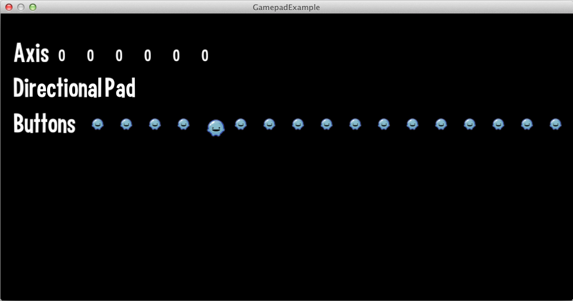

title: Gamepad Example
description: How to use the Loom Gamepad API
source: src/GamePadExample.ls
!------

## Overview
This example shows basic usage of the Loom Gamepad API.

On Mac OS X, you can use a WiiMote and [WJoy application](https://code.google.com/p/wjoy/).

On Windows you can use an XBox 360 Controller or any controller that uses the Windows Game Controller API.  You can open up the Game Controller panel on Windows by going to Start > Run > joy.cpl.  Anything that shows up in Game Controller panel will work with the Loom Gamepad API. 

## Try It
@cli_usage

## Screenshots

If Loom cannot find gamepads the example will show "No Gamepad Detected!"

## Code
@insert_source