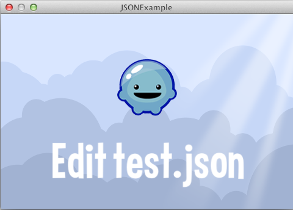
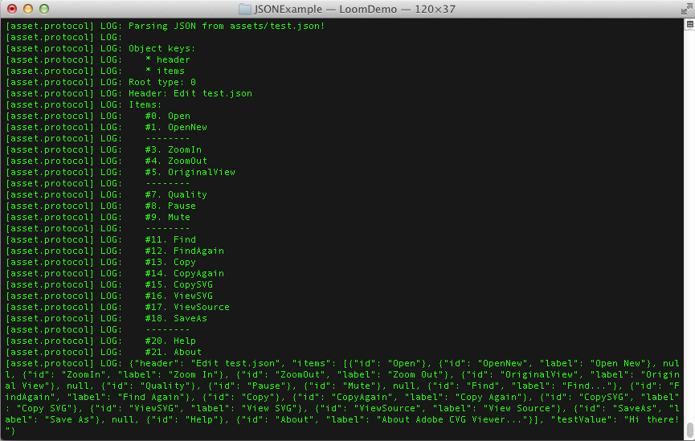

title: JSON Example
description: Usage of the Loom JSON API
source: src/JSONExample.ls
!------

## Overview
Basic usage of the Loom JSON API.

Output from example is traced to the console.

## Try It
@cli_usage

## Screenshots

_Example Terminal Output_

## Code
@insert_source