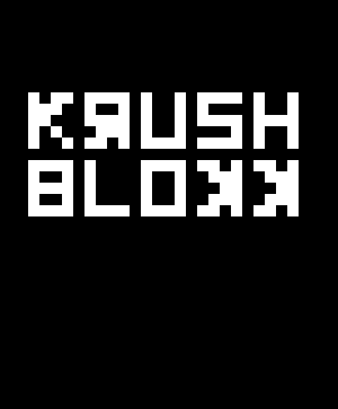
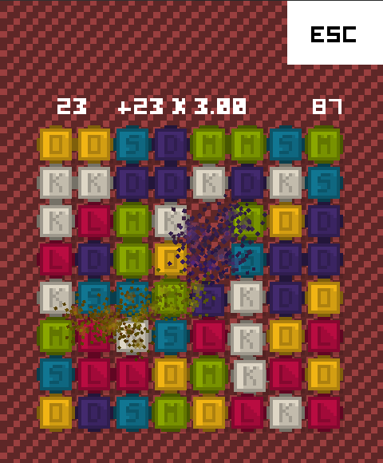

title: Krush Blokk
description: Full match 3 game including theming, views, LML, sound effects, particles and tweens.
thumbnail: images/screenshot.png
!------

## Overview
Full implementation of a match 3 type game with a complete gameplay loop from the intro through picking game modes, having end conditions, a results screen and support for interstitial ads.

Features include:

* having a rough pixel-art look,
* a system of views (screen display states),
* using Feathers components with a custom theme including a custom font and styles,
* responsive layout for the game and views,
* usage of custom jugglers for pausable game transitions / animations,
* special effects including
    * screen shake,
    * dynamic sound effects,
    * lots of tweens and
    * a particle system for explosions,
* scrolling dynamically color tinted tiled background,
* touch input logic allowing for two-touch swaps and drag to swap,
* game modes including
    * timed and unlimited and
    * constrained or freeform (allowing non-matching tile swaps),
* algorithm heavy core making use of Vectors for game logic,
* simple state machines for explicit game states and
* a momentum-based scoring system.

## Try It
@cli_usage

## Screenshots

