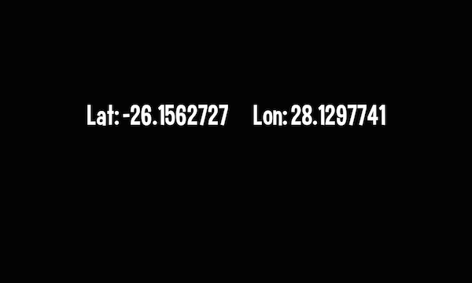

title: Location Example
description: Simple example which can be used to display the current Location of the Mobile device.
source: src/LocationExample.ls
thumbnail: images/screenshot.png
!------

## Overview
Simple example which can be used to display the current Location (as Latitude and Longitude) of the Mobile. device

## Try It
@cli_usage

## Screenshot

## Code
@insert_source
