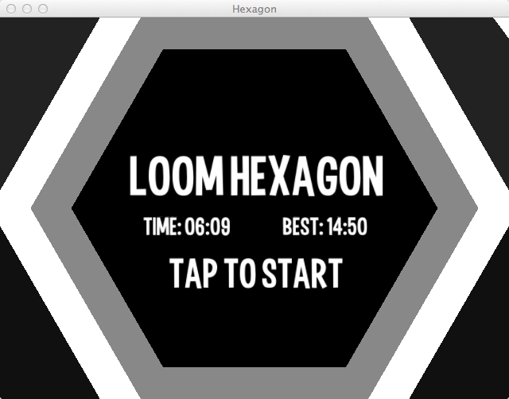
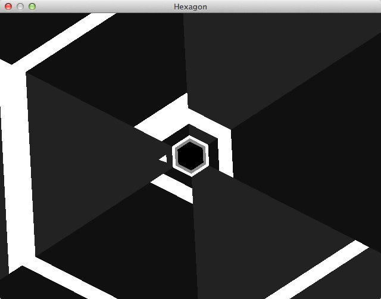

title: Loom Hexagon
description: A small game based on Terry Cavaghn's 'Hexagon'
source: src/LoomHexagon.ls
!------

## Overview
Loom Hexagon is a small demo game based off of Terry Cavanagh's Hexagon, which can be found at http://jayisgames.com/games/hexagon/. The purpose
of this demo is to showcase Loom's ability to create fun and addicting mobile games.

## Try It
@cli_usage

## Screenshot

## Code
@insert_source