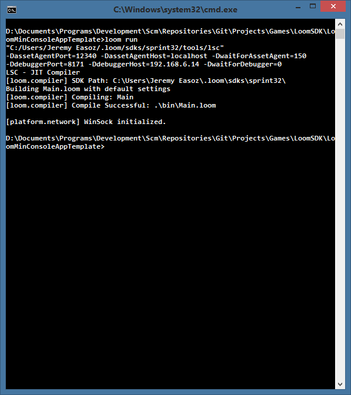

title: Loom Minimal Console Application Template
description: A Loom Application Template!
source: src/LoomMinConsoleAppTemplate.ls
thumbnail: images/screenshot.png
!------

## Overview

This is a Loom minimal console application template. 

Using the Loom Minimal Console Application Template is simple. Use it for the base of any new project to quickly and easily get started creating console based applications and tools using the LoomSDK.

## Try It
@cli_usage

## Screenshot

## Code
@insert_source