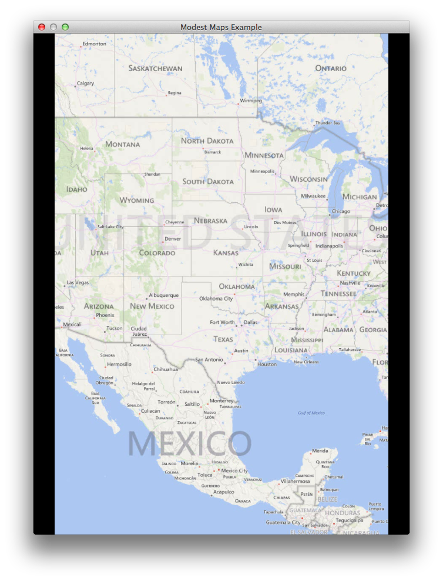

title: Modest Maps Example
description: Simple app that shows off the Loom integration of Modest Maps.
source: src/ModestMaps.ls
thumbnail: images/screenshot.png
!------

## Overview
Simple app that shows off the Loom integration of Modest Maps.  It allows you to pan the map with the mouse [Left Click + Move], zoom with the mouse [double click], zoom in [- KEY] and out [= KEY] with the keyboard, and toggle between 2 separate Map Providers [M Key].

## Try It
@cli_usage

## Screenshot

## Code
@insert_source
