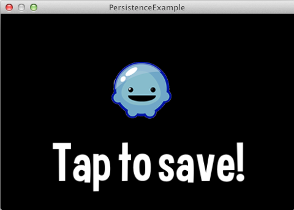
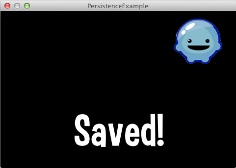
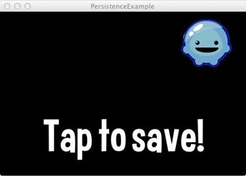

title: Persistence Example
description: Simple example demostrating saving persistent data across app sessions.
source: src/PersistenceExample.ls
thumbnail: images/screenshot.png
!------

## Overview
Simple example demostrating saving persistent data across app sessions.

Load the application, tap on the screen to move the Poly.  Close the application, then re-open the application and the Poly will be in the location where you tapped last.

This example will write a UserDefault XML file located here on Mac OS X:
`~/Library/Application\ Support/com.loomengine.PersistenceExampleUserDefault.xml`

## Try It
@cli_usage

## Screenshots
_Initial Load_

_After tapping the screen_

_After restarting the app_

## Code
@insert_source
