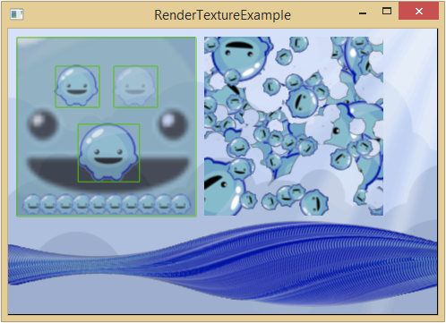

title: Render Texture Example
description: Shows example usage of the render texture API.
source: src/RenderTextureExample.ls
thumbnail: images/screenshot.png
!------

## Overview
An example showing the use of render textures as a canvas that can be drawn on. The display object provided is drawn with it's respective transform matrix and alpha. The matrix parameter on the draw functions can be used to override the transform and alpha can be modified by the alpha multiplier parameter.

## Try It
@cli_usage

## Screenshot

## Code
@insert_source
