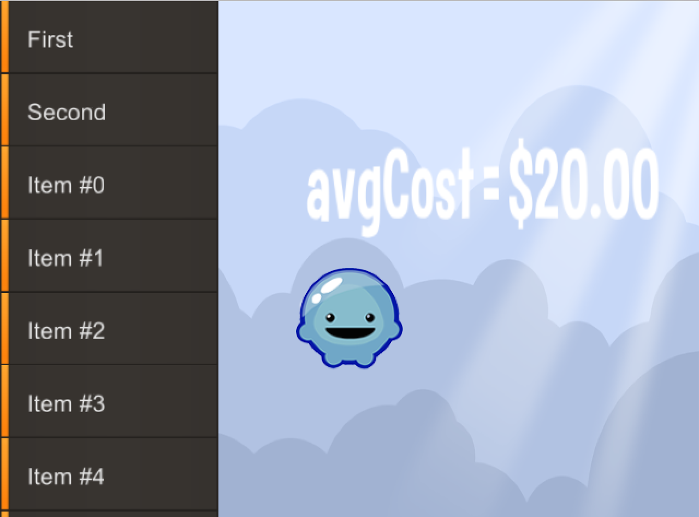

title: RobotLegs and Feathers Example
description: How to use RobotLegs in Loom with Feathers, including a full port of RobotLegs v1.
source: src/RobotLegs.ls
thumbnail: images/screenshot.png
!------

## Overview
How to use RobotLegs in Loom with Feathers, including a full port of RobotLegs v1.

RobotLegs is a powerful MVC framework with dependency injection. It scales from small and simple solo projects up to large and complex team efforts. It integrates well with the Loom DisplayList, including Feathers. This example includes a port of RobotLegs to LoomScript.

This example exercises some basic features of RobotLegs. To learn more about RobotLegs, visit http://robotlegs.org/ for more indepth information or post on the Loom SDK forums!.

## Try It
@cli_usage

## Screenshot

## Code
@insert_source
