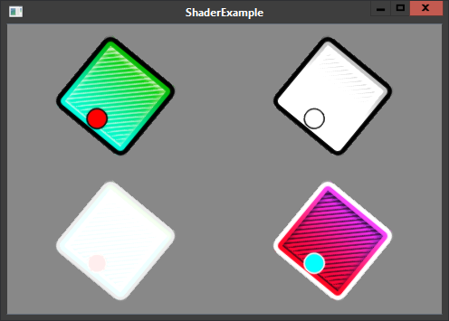

title: ShaderExample
description: A demonstration of custom shader objects
source: src/ShaderExample.ls
thumbnail: images/screenshot.png
!------

## Overview
This example demonstrates the usage of custom shaders. There are 4 quads displayed, from top left to bottom right:
one with the default shader, one with a grayscale shader, one with a invert-colors shader and one with a pulsating
brightness shader.

## Try It
@cli_usage

## Screenshots

## Code
@insert_source
