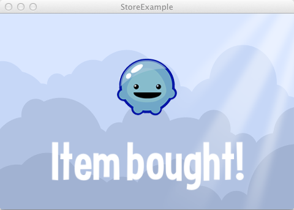

title: Store Example
description: Example for in app payment using the Loom Store API.
source: src/StoreExample.ls
!------

## Overview
Example for in app payment using the Loom Store API.

**WARNING:** This example does not work out of box. Testing in app payment
on device requires that you have valid certificates, application ids, 
product ids, test accounts, and legal agreements in place with your
platform provider under your development account. This varies by 
platform, and requires setup. See the Loom Manual for details on getting 
set up for in app purchase.

This application launches, queries the store for SKU information, then 
once information is received, it prompts you to purchase an item. As each
step completes it logs output and updates the app caption.

### Learn More
[LoomCast Episode #3 - Loom Store & In App Purchase on Android](http://loomcasts.com/episodes/3-loom-store-in-app-purchase-on-android?ap=true)

## Try It
@cli_usage

## Screenshot

## Code
@insert_source