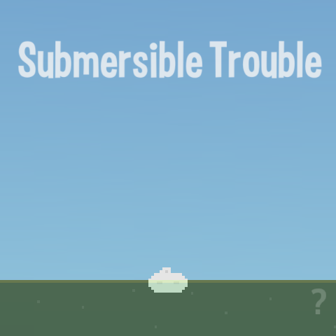

title: Submersible Trouble
description: Sea themed game where you try to reach a great depth while avoiding naval mines.
thumbnail: images/screenshot.png
!------

## Overview
Sea themed game where you try to reach a great depth while avoiding naval mines.

It features touch input, winning and failure states, finite state machines for general game state, the player and AI, simple physics engine, rough pixel art, dynamic sound effects and smooth camera movement and transitions.

Touch / click and drag to guide the submersible around the deep sea depths and try to avoid mines while you're at it!

## Try It
@cli_usage

## Screenshot

