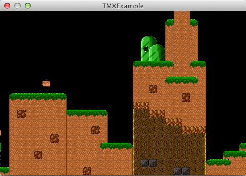

title: TMX Example
description: Create and render a TMX tilemap created by Tiled.
source: src/TMXExample.ls
thumbnail: images/screenshot.png
!------

## Overview
Create and render a TMX tilemap created by [Tiled](http://www.mapeditor.org).

## Try It
@cli_usage

## Screenshot

## Code
@insert_source
