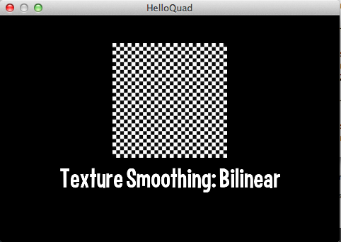

title: Texture Smoothing Example
description: Basic usage of Texture Smoothing with Loom2D
source: src/TextureSmoothingExample.ls
!------

## Overview
Basic usage of a Texture Smoothing with Loom2D

## Try It
@cli_usage

## Screenshot

## Code
@insert_source