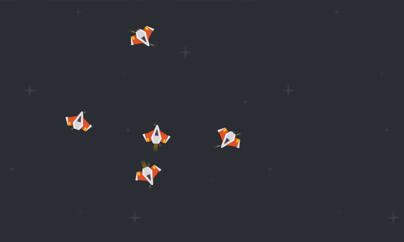

title: Thrusties
description: Basic spaceship swarm simulation with semi-realistic thrusting and physics.
thumbnail: images/screenshot.png
!------

## Overview
Basic spaceship swarm simulation with semi-realistic thrusting and physics.

You can touch / click and drag to set a target for little spaceships to fly to. Shows implementation of a simple physics engine, multiple interactive actors and dynamic engine sounds.

## Try It
@cli_usage

## Screenshots

