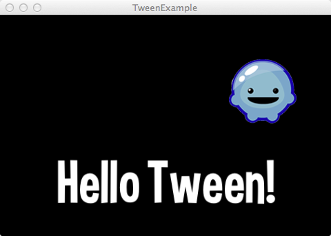

title: Tween Example
description: How to use the Tween Library.
source: src/TweenExample.ls
thumbnail: images/screenshot.png
!------

## Overview
How to use the Tween Library.

## Try It
@cli_usage

## Screenshot

## Code
@insert_source
