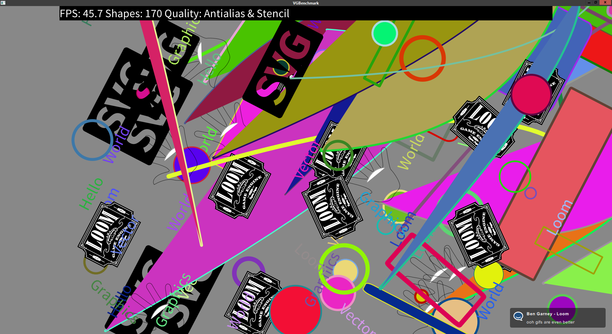

title: VGBenchmark
description: Benchmark app for vector graphics rendering
source: src/Benchmark.ls
thumbnail: images/screenshot.png
!------

## Overview
A benchmark app that initially displays 150 random shapes - text, circles,
rectangles and SVG files. 

To increase shape count by 10 - tap the top third of the screen, to decrease
shape count by 10 - tap the bottom third of the screen. To change quality
settings, tap the middle of the screen.

## Try It
@cli_usage

## Screenshots

## Code
@insert_source
